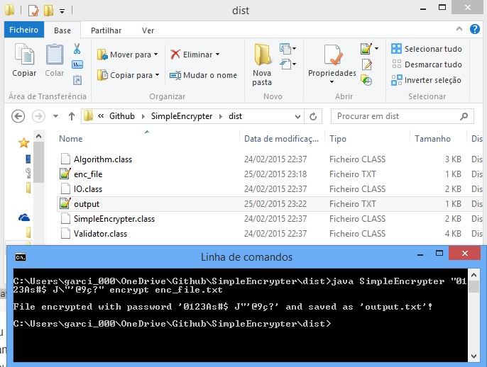

SimpleEncrypter
============
In order to learn how to program in Java, I decided to build a program that implements a modified version of a simple encryption algorithm I found some years ago to be used by some telecommunication’s company.
You check a little more information about it [here](http://filipe-garcia.com/blog/2015/02/encryption-algorithm-in-java)!


Usage:
============
You need to [have Java installed](https://www.java.com/en/download/help/download_options.xml). Just clone this repo, open the command line, navigate to the '<code>/dist</code>' directory and type:
```sh
# run the program
java SimpleEncrypter <password> <option> <file>


# a real life example could be:
java SimpleEncrypter 0123456789abcdef encrypt clear_text_file.txt

# or
java SimpleEncrypter "0123As#$ J\"'@9ç?" decrypt encrypted_text_file.txt
```
You can use many special characters as password with some restrictions. As you can see in the last example, the password is between " " because it contains a space, and the ' " ' has a ' \ ' before it. You should already be confortable using this sort of notation. The program itself is very self-explanatory, just run it without any arguments and read the '*USAGE:*'.

You can also compile the source that is in the '<code>/src</code>' directory with:
```sh
# compile the source
javac SimpleEncrypter.java 
```


How it works:
============
This is a pretty basic algorithm that uses a two-dimensional array of 16x16 (hence the password length). Any character in that array matches a coordinate <code>(x, y)</code>, given by that password. So imagine a password '<code>a&3</code>' (lets use a 3x3 array for now):
```
 + (a), (&), (3)
(a)'a', 'b', 'c'
(&)'d', 'e', 'f'
(3)'g', 'h', 'i'
```
As you can see, the character '<code>b</code>', for example, is encoded into '<code>&a</code>'. But if you want to encode '<code>bb</code>', it will not match '<code>&a&a</code>'. This algorithm inserts every new character exactly in the middle of the string, so it will become '<code>&&aa</code>'. If you want to write '<code>abh</code>', it will output '<code>a&&3aa</code>'. Simple right?


Screenshot:
============



Contributing:
============
Since this is not a 'production' algorithm, I'm not actually maintaining it, so I don't really have a roadmap here. But because it was built in order to learn about the language, I welcome any corrections, changes and/or improvements. Especially on implementing good coding practices! Anything is really helpful.


___
Author
============
Filipe Garcia [https://github.com/fgarci03/](https://github.com/fgarci03/)

Copyright - [MIT](LICENSE.md)
